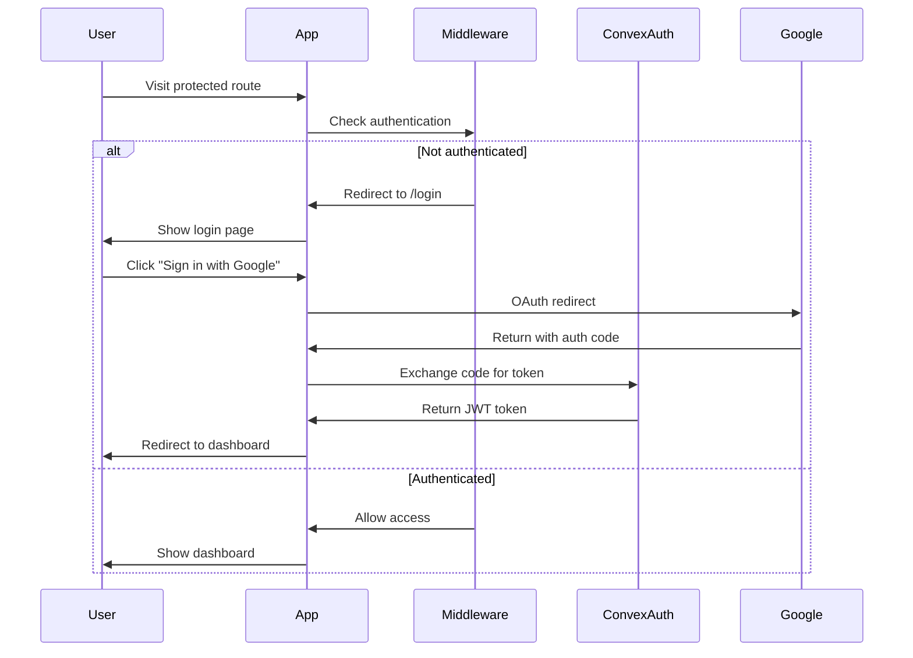

# Applications Documentation

This document covers the frontend applications in the DevResume.ai project: the dashboard application and the marketing website.

## Table of Contents

- [Overview](#overview)
- [Dashboard Application](#dashboard-application)
- [Marketing Website](#marketing-website)
- [Shared Features](#shared-features)
- [Routing & Navigation](#routing--navigation)
- [State Management](#state-management)
- [Internationalization](#internationalization)
- [Performance Optimization](#performance-optimization)

## Overview

The project consists of two Next.js applications:

1. **Dashboard App** (`apps/app`) - The main SaaS application with user authentication and features
2. **Marketing Website** (`apps/web`) - Public-facing marketing site and landing pages

Both applications share common packages and follow consistent architectural patterns.

## Dashboard Application

### Purpose
The dashboard application is the core SaaS product where authenticated users manage their accounts, subscriptions, and access application features.

### Key Features
- User authentication with Google OAuth
- User profile management with avatar uploads
- Subscription management with Polar integration
- Multi-language support (English, French, Spanish)
- Dark/light theme switching
- Real-time data synchronization
- Mobile-responsive design

### Project Structure

```
apps/app/src/
├── app/
│   ├── [locale]/                    # Internationalized routes
│   │   ├── (dashboard)/            # Protected dashboard routes
│   │   │   ├── _components/        # Dashboard-specific components
│   │   │   │   ├── header.tsx      # Page headers
│   │   │   │   ├── navigation.tsx  # Main navigation
│   │   │   │   ├── language-switcher.tsx
│   │   │   │   └── theme-switcher.tsx
│   │   │   ├── layout.tsx          # Dashboard layout
│   │   │   ├── page.tsx            # Dashboard home
│   │   │   └── settings/           # Settings pages
│   │   │       ├── layout.tsx      # Settings layout
│   │   │       ├── page.tsx        # General settings
│   │   │       └── billing/        # Billing settings
│   │   │           └── page.tsx
│   │   ├── (public)/               # Public routes
│   │   │   └── login/              # Authentication
│   │   │       └── page.tsx
│   │   ├── layout.tsx              # Root layout
│   │   └── onboarding/             # User onboarding
│   │       ├── layout.tsx
│   │       └── page.tsx
│   ├── convex-client-provider.tsx  # Convex client setup
│   └── global-error.tsx            # Global error boundary
├── components/                      # Shared components
│   ├── google-signin.tsx           # Google OAuth button
│   └── sign-out.tsx                # Sign out functionality
├── locales/                        # Internationalization
│   ├── client.ts                   # Client-side i18n
│   ├── server.ts                   # Server-side i18n
│   ├── en.ts                       # English translations
│   ├── es.ts                       # Spanish translations
│   └── fr.ts                       # French translations
├── middleware.ts                   # Route protection
├── types.tsx                       # TypeScript types
└── env.mjs                         # Environment validation
```

### Authentication Flow



### Key Components

#### Navigation Component
```typescript
export function Navigation({
  preloadedUser,
  preloadedProducts,
}: {
  preloadedUser: Preloaded<typeof api.users.getUser>;
  preloadedProducts: Preloaded<typeof api.subscriptions.listAllProducts>;
}) {
  const user = usePreloadedQuery(preloadedUser);
  const products = usePreloadedQuery(preloadedProducts);
  
  // Navigation logic with user dropdown,
  // subscription status, and upgrade options
}
```

#### Header Component
```typescript
export function Header({ 
  title, 
  description 
}: { 
  title: string; 
  description: string; 
}) {
  return (
    <div className="flex flex-col gap-4 pb-8">
      <h1 className="text-3xl font-bold">{title}</h1>
      <p className="text-muted-foreground">{description}</p>
    </div>
  );
}
```

### Middleware Implementation

```typescript
export default convexAuthNextjsMiddleware(async (request, { convexAuth }) => {
  const isAuthenticated = await convexAuth.isAuthenticated();
  const isSignIn = isSignInPage(request);
  
  // Redirect authenticated users away from login
  if (isSignIn && isAuthenticated) {
    return nextjsMiddlewareRedirect(request, "/");
  }
  
  // Redirect unauthenticated users to login
  if (!isSignIn && !isAuthenticated) {
    return nextjsMiddlewareRedirect(request, "/login");
  }
  
  // Apply internationalization
  return I18nMiddleware(request);
});
```

### Subscription Management

The app integrates with Polar for subscription management:

```typescript
// Checkout component
<CheckoutLink
  polarApi={api.subscriptions}
  productIds={[monthlyProduct.id, yearlyProduct.id]}
>
  <Button>Upgrade to PRO</Button>
</CheckoutLink>
```

## Marketing Website

### Purpose
The marketing website serves as the public face of the product, providing information about features, pricing, and allowing users to sign up.

### Key Features
- Static site generation for performance
- SEO optimization
- Responsive design
- Call-to-action integration
- Contact form
- Analytics integration

### Project Structure

```
apps/web/src/
├── app/
│   ├── layout.tsx              # Root layout
│   ├── page.tsx                # Homepage
│   ├── talk-to-us/             # Contact page
│   │   └── page.tsx
│   ├── opengraph-image.png     # Social media images
│   ├── twitter-image.png
│   └── convex-client-provider.tsx
├── components/                  # Website components
│   ├── animated-text.tsx       # Text animations
│   ├── cal-embed.tsx           # Calendar integration
│   ├── copy-text.tsx           # Copy-to-clipboard
│   ├── footer.tsx              # Site footer
│   ├── header.tsx              # Site header
│   └── subscribe-form.tsx      # Newsletter signup
├── fonts/                      # Custom fonts
│   └── DepartureMono-Regular.woff2
└── env.ts                      # Environment validation
```

### Homepage Implementation

```typescript
export default function Page() {
  return (
    <div className="h-screen w-screen flex flex-col items-center justify-center relative overflow-hidden">
      {/* Grid background */}
      <div className="absolute inset-0 bg-[linear-gradient(...)] -z-10" />
      
      {/* Hero content */}
      <h1 className="font-departure text-[40px] md:text-[84px]">
        <AnimatedText text="Production ready code" />
      </h1>
      
      <p className="text-center md:text-xl max-w-[80%] mt-2 md:mt-6">
        An open-source starter kit based on{" "}
        <a href="https://midday.ai" className="underline">Midday</a>
        . Now on{" "}
        <a href="https://convex.dev" className="underline">Convex</a>
        .
      </p>
      
      {/* CTA */}
      <div className="mt-10 mb-8">
        <CopyText value="npm create @convex-dev/v1@latest" />
      </div>
      
      <a href={process.env.NEXT_PUBLIC_APP_URL}>
        <span>Get started →</span>
      </a>
    </div>
  );
}
```

### Layout Structure

```typescript
export default function RootLayout({
  children,
}: {
  children: React.ReactNode;
}) {
  return (
    <html lang="en" suppressHydrationWarning>
      <body className={cn(
        `${DepartureMono.variable} ${GeistSans.variable} ${GeistMono.variable}`,
        "antialiased dark",
      )}>
        <ConvexClientProvider>
          <Header />
          {children}
          <Footer />
        </ConvexClientProvider>
        <AnalyticsProvider />
      </body>
    </html>
  );
}
```

## Shared Features

### Theme System

Both applications support dark/light themes:

```typescript
// Dashboard app
<ThemeProvider
  attribute="class"
  defaultTheme="system"
  enableSystem
  disableTransitionOnChange
>
  {children}
</ThemeProvider>

// Marketing site (forced dark theme)
<body className="antialiased dark">
```

### Analytics Integration

OpenPanel analytics is integrated across both applications:

```typescript
// Analytics provider
<AnalyticsProvider />

// Tracking events
import { track } from "@v1/analytics/client";

track({
  event: "user_signup",
  properties: { method: "google" }
});
```

### Error Handling

Global error boundaries catch and handle errors:

```typescript
// global-error.tsx
export default function GlobalError({
  error,
  reset,
}: {
  error: Error & { digest?: string };
  reset: () => void;
}) {
  return (
    <html>
      <body>
        <h2>Something went wrong!</h2>
        <button onClick={() => reset()}>Try again</button>
      </body>
    </html>
  );
}
```

## Routing & Navigation

### Dashboard Routes

```
/                           # Dashboard home
/settings                   # General settings
/settings/billing           # Billing settings
/login                      # Authentication
/onboarding                 # User onboarding
```

### Internationalized Routes

```
/en/                        # English (default)
/fr/                        # French
/es/                        # Spanish
```

### Route Groups

- `(dashboard)` - Protected routes requiring authentication
- `(public)` - Public routes (login, etc.)

## State Management

### Server State
- Convex queries for real-time data
- Automatic cache invalidation
- Optimistic updates

### Client State
- React's built-in state management
- URL state with `nuqs`
- Theme state with `next-themes`

### Example Usage

```typescript
// Real-time user data
const user = useQuery(api.users.getUser);

// URL state management
const [tab, setTab] = useQueryState('tab', {
  defaultValue: 'general'
});

// Theme management
const { theme, setTheme } = useTheme();
```

## Internationalization

### Configuration

```typescript
// next-international configuration
const I18nMiddleware = createI18nMiddleware({
  locales: ["en", "fr", "es"],
  defaultLocale: "en",
  urlMappingStrategy: "rewrite",
});
```

### Usage

```typescript
// Server components
const t = await getScopedI18n("dashboard");

// Client components
const t = useScopedI18n("dashboard");

// In templates
<h1>{t("title")}</h1>
<p>{t("description")}</p>
```

### Translation Files

```typescript
// locales/en.ts
export default {
  dashboard: {
    title: "Create your App",
    description: "Build your app on top of Convex SaaS...",
  },
  settings: {
    title: "Settings",
    // ...
  },
} as const;
```

## Performance Optimization

### Dashboard App
- Server Components by default
- Strategic Client Components
- Preloaded queries for critical data
- Image optimization with Next.js Image
- Bundle splitting and lazy loading

### Marketing Website
- Static site generation
- Optimized images and fonts
- Minimal JavaScript bundle
- CDN distribution

### Monitoring
- Sentry for error tracking
- OpenPanel for analytics
- Web Vitals monitoring
- Performance budgets

---

Both applications are designed for optimal performance, user experience, and maintainability while sharing common infrastructure and design patterns. 