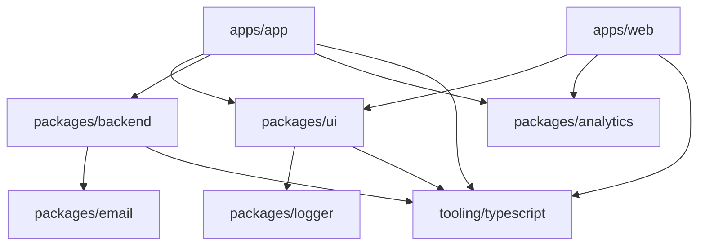
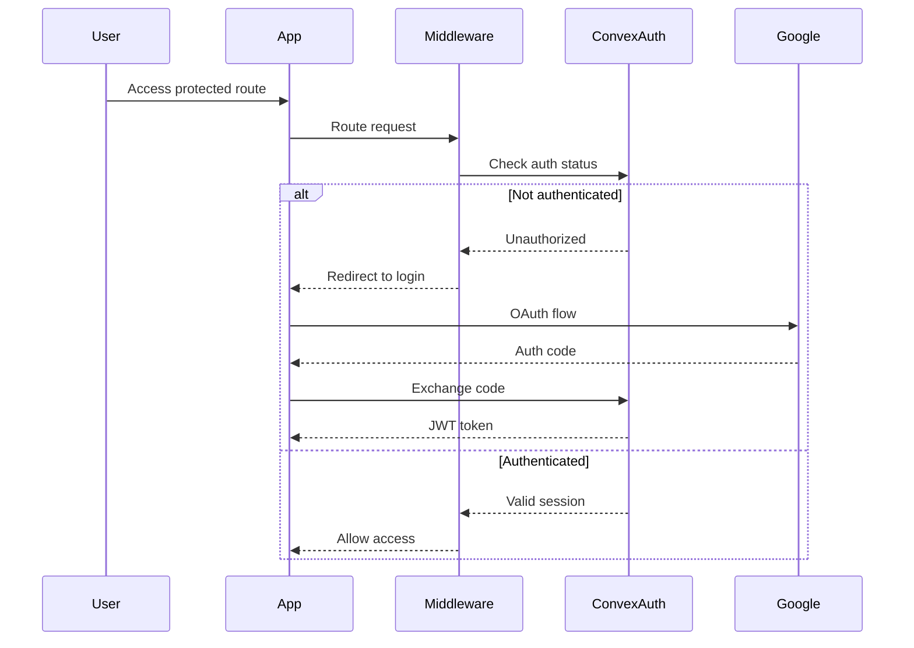
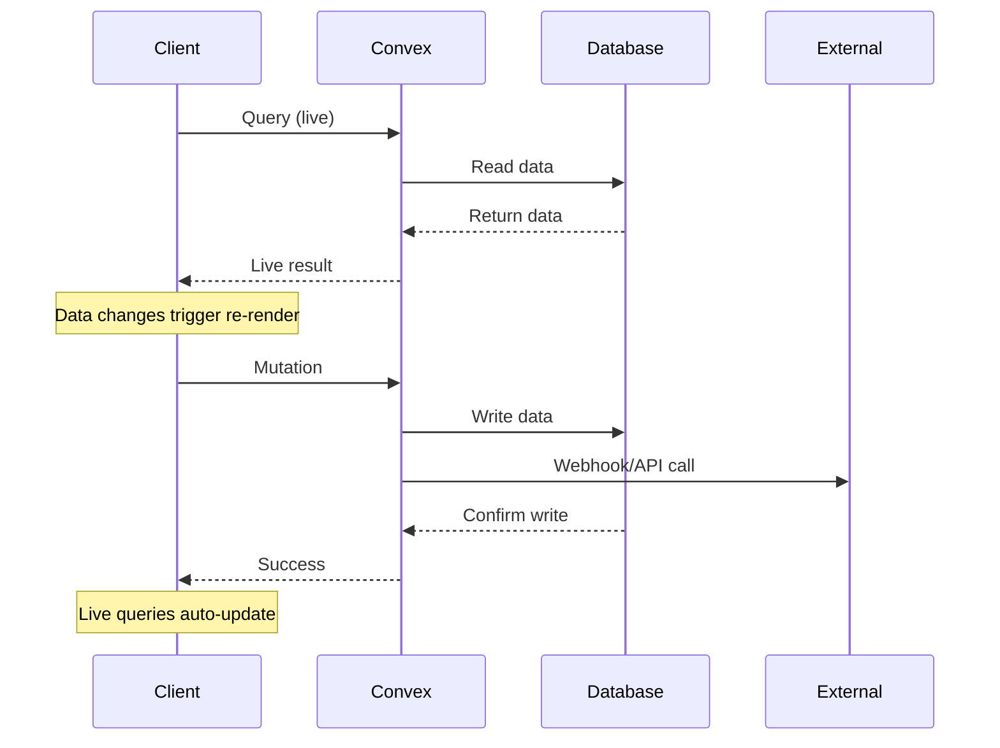

# Architecture Documentation

This document provides a comprehensive overview of the system architecture, design patterns, and technical decisions behind DevResume.ai.

## Table of Contents

- [System Overview](#system-overview)
- [Monorepo Architecture](#monorepo-architecture)
- [Frontend Architecture](#frontend-architecture)
- [Backend Architecture](#backend-architecture)
- [Data Flow](#data-flow)
- [Security Architecture](#security-architecture)
- [Scalability Considerations](#scalability-considerations)
- [Design Patterns](#design-patterns)

## System Overview

DevResume.ai follows a modern full-stack architecture built around the Convex Backend-as-a-Service platform. The system is designed for scalability, maintainability, and developer experience.

### High-Level Architecture

```mermaid
graph TB
    subgraph "Frontend Layer"
        WEB[Marketing Website<br/>Next.js]
        APP[Dashboard App<br/>Next.js]
    end
    
    subgraph "Shared Layer"
        UI[UI Components<br/>@v1/ui]
        ANALYTICS[Analytics<br/>@v1/analytics]
        EMAIL[Email Templates<br/>@v1/email]
        LOGGER[Logger<br/>@v1/logger]
    end
    
    subgraph "Backend Layer"
        CONVEX[Convex Backend<br/>@v1/backend]
        DB[(Database)]
        STORAGE[(File Storage)]
        AUTH[Authentication]
    end
    
    subgraph "External Services"
        POLAR[Polar<br/>Billing]
        RESEND[Resend<br/>Email]
        OPENPANEL[OpenPanel<br/>Analytics]
        SENTRY[Sentry<br/>Monitoring]
    end
    
    WEB --> UI
    APP --> UI
    APP --> ANALYTICS
    WEB --> ANALYTICS
    
    WEB --> CONVEX
    APP --> CONVEX
    
    CONVEX --> DB
    CONVEX --> STORAGE
    CONVEX --> AUTH
    
    CONVEX --> POLAR
    CONVEX --> RESEND
    ANALYTICS --> OPENPANEL
    WEB --> SENTRY
    APP --> SENTRY
    
    EMAIL --> RESEND
```

## Monorepo Architecture

The project uses a monorepo structure managed by Turborepo, providing several key benefits:

### Benefits
- **Code Sharing**: Common utilities, components, and configurations are shared across applications
- **Consistent Dependencies**: Centralized dependency management ensures version consistency
- **Efficient Builds**: Turborepo's caching and parallelization optimize build times
- **Type Safety**: Shared TypeScript configurations ensure consistent typing across packages

### Workspace Structure

```
devresume.ai/
├── apps/                    # Applications (deployable units)
│   ├── app/                # Dashboard application
│   └── web/                # Marketing website
├── packages/               # Shared packages
│   ├── analytics/          # Analytics utilities
│   ├── backend/           # Convex backend
│   ├── email/             # Email templates
│   ├── logger/            # Logging utilities
│   └── ui/                # UI component library
└── tooling/               # Development tools
    └── typescript/        # Shared TS configs
```

### Dependency Graph



## Frontend Architecture

### Next.js App Router

Both applications use Next.js 14 with the App Router, providing:
- **Server Components**: Default server-side rendering for better performance
- **Client Components**: Strategic use of client-side interactivity
- **File-based Routing**: Intuitive routing structure
- **Layouts**: Shared layouts for consistent UI structure

### Application Structure

#### Dashboard App (`apps/app`)
```
src/
├── app/
│   ├── [locale]/           # Internationalized routes
│   │   ├── (dashboard)/    # Dashboard route group
│   │   │   ├── _components/ # Dashboard-specific components
│   │   │   ├── page.tsx    # Dashboard home
│   │   │   └── settings/   # Settings pages
│   │   ├── (public)/       # Public route group
│   │   │   └── login/      # Authentication pages
│   │   └── layout.tsx      # Root layout
│   └── globals.css         # Global styles
├── components/             # Shared components
├── locales/               # Internationalization
└── middleware.ts          # Route protection
```

#### Marketing Website (`apps/web`)
```
src/
├── app/
│   ├── page.tsx           # Homepage
│   ├── talk-to-us/        # Contact page
│   └── layout.tsx         # Root layout
└── components/            # Website components
```

### State Management

The application uses a minimal state management approach:
- **Server State**: Convex queries and mutations handle server state
- **Client State**: React's built-in state management (useState, useReducer)
- **URL State**: `nuqs` for URL-based state management
- **Theme State**: `next-themes` for theme management

### Styling Architecture

- **Tailwind CSS**: Utility-first CSS framework
- **CSS Variables**: Design tokens for consistent theming
- **Component Variants**: `class-variance-authority` for component styling
- **Dark Mode**: Built-in dark/light theme support

## Backend Architecture

### Convex Platform

Convex provides a complete backend solution with:
- **Database**: Document-based database with ACID transactions
- **Functions**: Server-side functions (queries, mutations, actions)
- **Authentication**: Built-in auth with multiple providers
- **File Storage**: Integrated file storage system
- **Real-time**: Live queries for reactive UIs
- **Webhooks**: HTTP endpoints for external integrations

### Function Types

```typescript
// Query: Read-only operations
export const getUser = query({
  handler: async (ctx) => {
    // Database reads only
  }
});

// Mutation: Database write operations
export const updateUser = mutation({
  args: { name: v.string() },
  handler: async (ctx, args) => {
    // Database reads and writes
  }
});

// Action: External API calls and complex logic
export const sendEmail = action({
  handler: async (ctx) => {
    // Can call external APIs
    // Can schedule functions
  }
});
```

### Database Schema

```typescript
export default defineSchema({
  ...authTables, // Convex Auth tables
  users: defineTable({
    // Auth fields
    name: v.optional(v.string()),
    email: v.optional(v.string()),
    image: v.optional(v.string()),
    
    // Custom fields
    username: v.optional(v.string()),
    imageId: v.optional(v.id("_storage")),
  }).index("email", ["email"]),
});
```

## Data Flow

### Authentication Flow



### Data Synchronization



## Security Architecture

### Authentication & Authorization

- **OAuth Integration**: Google OAuth via Convex Auth
- **JWT Tokens**: Secure token-based authentication
- **Route Protection**: Middleware-based route protection
- **Session Management**: Automatic session handling

### Data Security

- **Input Validation**: Zod schemas for type-safe validation
- **SQL Injection Prevention**: Document database prevents SQL injection
- **XSS Protection**: React's built-in XSS protection
- **CSRF Protection**: SameSite cookies and CSRF tokens

### API Security

- **Function-level Auth**: Each Convex function checks authentication
- **Rate Limiting**: Built-in rate limiting for API calls
- **Webhook Validation**: Signed webhooks for external integrations

## Scalability Considerations

### Frontend Scalability

- **Static Generation**: Marketing pages are statically generated
- **Code Splitting**: Automatic code splitting with Next.js
- **Image Optimization**: Next.js Image component with WebP support
- **CDN Distribution**: Vercel Edge Network for global distribution

### Backend Scalability

- **Serverless Functions**: Auto-scaling Convex functions
- **Database Sharding**: Convex handles database scaling automatically
- **Caching**: Built-in query result caching
- **File Storage**: Scalable file storage with CDN distribution

### Performance Optimizations

- **Bundle Analysis**: Webpack Bundle Analyzer for optimization
- **Tree Shaking**: Unused code elimination
- **Lazy Loading**: Dynamic imports for non-critical components
- **Web Vitals**: Performance monitoring and optimization

## Design Patterns

### Component Patterns

- **Compound Components**: Complex components with multiple parts
- **Render Props**: Flexible component composition
- **Higher-Order Components**: Cross-cutting concerns
- **Custom Hooks**: Reusable stateful logic

### Data Patterns

- **Repository Pattern**: Data access abstraction
- **Observer Pattern**: Live queries and reactive updates
- **Command Pattern**: Mutations as commands
- **Factory Pattern**: Component and utility factories

### Error Handling Patterns

- **Error Boundaries**: React error boundaries for UI errors
- **Result Pattern**: Explicit error handling in functions
- **Retry Pattern**: Automatic retries for failed operations
- **Circuit Breaker**: Preventing cascading failures

---

This architecture provides a solid foundation for building scalable, maintainable SaaS applications while maintaining developer productivity and code quality. 