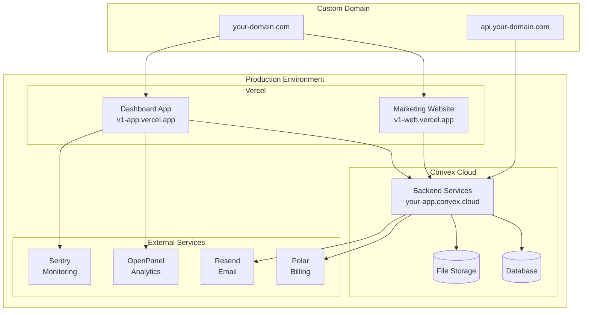

# Deployment Guide

This document provides comprehensive guidance for deploying DevResume.ai to production environments.

## Table of Contents

- [Overview](#overview)
- [Prerequisites](#prerequisites)
- [Environment Setup](#environment-setup)
- [Convex Deployment](#convex-deployment)
- [Frontend Deployment](#frontend-deployment)
- [Domain Configuration](#domain-configuration)
- [Monitoring & Analytics](#monitoring--analytics)
- [Security Considerations](#security-considerations)
- [Maintenance](#maintenance)
- [Troubleshooting](#troubleshooting)

## Overview

DevResume.ai uses a modern deployment architecture with:
- **Convex** for backend services (database, API, auth)
- **Vercel** for frontend applications (recommended)
- **External services** for email, analytics, and billing

### Deployment Architecture



## Prerequisites

### Required Accounts

1. **Convex Account** - Backend services
   - Sign up at [dashboard.convex.dev](https://dashboard.convex.dev)
   - Create a new project

2. **Vercel Account** - Frontend hosting
   - Sign up at [vercel.com](https://vercel.com)
   - Connect your GitHub repository

3. **External Service Accounts**
   - [Polar](https://polar.sh) - Billing and subscriptions
   - [Resend](https://resend.com) - Email delivery
   - [OpenPanel](https://openpanel.dev) - Analytics
   - [Sentry](https://sentry.io) - Error monitoring

### Required Tools

```bash
# Convex CLI
npm install -g convex

# Vercel CLI (optional)
npm install -g vercel

# Bun (for local development)
curl -fsSL https://bun.sh/install | bash
```

## Environment Setup

### 1. Convex Environment Variables

Create production environment in Convex dashboard:

```bash
# Backend environment variables
CONVEX_SITE_URL=https://your-domain.com
POLAR_ACCESS_TOKEN=your_polar_access_token
POLAR_WEBHOOK_SECRET=your_polar_webhook_secret
RESEND_API_KEY=your_resend_api_key
OPENPANEL_SECRET_KEY=your_openpanel_secret_key
SENTRY_DSN=your_sentry_dsn
```

### 2. Frontend Environment Variables

#### Dashboard App (`apps/app`)
```bash
# Vercel environment variables
NEXT_PUBLIC_CONVEX_URL=https://your-app.convex.cloud
NEXT_PUBLIC_OPENPANEL_CLIENT_ID=your_openpanel_client_id
NEXT_PUBLIC_APP_URL=https://app.your-domain.com
SENTRY_ORG=your_sentry_org
SENTRY_PROJECT=your_sentry_project
SENTRY_AUTH_TOKEN=your_sentry_auth_token
```

#### Marketing Website (`apps/web`)
```bash
# Vercel environment variables
NEXT_PUBLIC_CONVEX_URL=https://your-app.convex.cloud
NEXT_PUBLIC_OPENPANEL_CLIENT_ID=your_openpanel_client_id
NEXT_PUBLIC_APP_URL=https://app.your-domain.com
```

## Convex Deployment

### 1. Initial Setup

```bash
# Navigate to backend package
cd packages/backend

# Login to Convex
npx convex login

# Deploy to production
npx convex deploy --prod
```

### 2. Configure Authentication

```bash
# Set up authentication providers
npx @convex-dev/auth

# Follow prompts to configure:
# - Google OAuth (recommended)
# - GitHub OAuth (optional)
# - Email/password (optional)
```

### 3. Initialize Database

```bash
# Run initialization script
npx convex run init --prod

# This will:
# - Create Polar products
# - Set up initial data
# - Configure webhooks
```

### 4. Set Environment Variables

In Convex dashboard:
1. Go to Settings → Environment Variables
2. Add all required environment variables
3. Deploy changes

### 5. Configure Custom Domain (Optional)

```bash
# In Convex dashboard
# Go to Settings → Custom Domain
# Add: api.your-domain.com
# Follow DNS configuration instructions
```

## Frontend Deployment

### 1. Vercel Deployment

#### Automatic Deployment (Recommended)

1. **Connect Repository**
   - Go to [vercel.com/dashboard](https://vercel.com/dashboard)
   - Click "New Project"
   - Import your GitHub repository

2. **Configure Build Settings**
   ```json
   {
     "buildCommand": "cd ../.. && bun build --filter=@v1/app",
     "outputDirectory": ".next",
     "installCommand": "bun install",
     "framework": "nextjs"
   }
   ```

3. **Set Environment Variables**
   - Add all required environment variables
   - Use Vercel's environment variable UI

4. **Deploy**
   - Vercel will automatically deploy on push to main branch
   - Set up preview deployments for feature branches

#### Manual Deployment

```bash
# Install Vercel CLI
npm install -g vercel

# Deploy dashboard app
cd apps/app
vercel --prod

# Deploy marketing website
cd ../web
vercel --prod
```

### 2. Alternative Deployment Options

#### Netlify
```bash
# Build command
cd ../.. && bun build --filter=@v1/app

# Publish directory
.next

# Environment variables
# Add all required variables in Netlify dashboard
```

#### Self-Hosted (Docker)
```dockerfile
# Dockerfile for dashboard app
FROM node:18-alpine

WORKDIR /app
COPY package*.json ./
RUN npm install

COPY . .
RUN npm run build

EXPOSE 3000
CMD ["npm", "start"]
```

## Domain Configuration

### 1. DNS Setup

Configure DNS records for your domain:

```bash
# A Records
your-domain.com         → Vercel IP
app.your-domain.com     → Vercel IP
api.your-domain.com     → Convex IP

# CNAME Records (alternative)
your-domain.com         → cname.vercel-dns.com
app.your-domain.com     → cname.vercel-dns.com
api.your-domain.com     → your-app.convex.cloud
```

### 2. SSL Certificates

Both Vercel and Convex provide automatic SSL certificates:
- Vercel: Automatic SSL for all domains
- Convex: Automatic SSL for custom domains

### 3. Subdomain Configuration

```bash
# Marketing site
https://your-domain.com → apps/web

# Dashboard application  
https://app.your-domain.com → apps/app

# API endpoints
https://api.your-domain.com → Convex backend
```

## Monitoring & Analytics

### 1. Sentry Configuration

#### Setup
```bash
# Install Sentry CLI
npm install -g @sentry/cli

# Login to Sentry
sentry-cli login

# Create new project
sentry-cli projects create your-project-name
```

#### Configuration
```typescript
// sentry.client.config.ts
import * as Sentry from "@sentry/nextjs";

Sentry.init({
  dsn: process.env.SENTRY_DSN,
  tracesSampleRate: 1.0,
  environment: process.env.NODE_ENV,
});
```

### 2. OpenPanel Analytics

```typescript
// Analytics configuration
const analytics = {
  clientId: process.env.NEXT_PUBLIC_OPENPANEL_CLIENT_ID,
  apiUrl: "https://api.openpanel.dev",
  trackScreenViews: true,
  trackOutgoingLinks: true,
};
```

### 3. Performance Monitoring

```bash
# Web Vitals tracking
# Automatically enabled in Next.js
# View metrics in Vercel Analytics

# Custom performance monitoring
import { track } from "@v1/analytics/client";

track({
  event: "performance_metric",
  metric: "page_load_time",
  value: loadTime,
});
```

## Security Considerations

### 1. Environment Variables

```bash
# ✅ Secure practices
# - Use different secrets for dev/prod
# - Rotate secrets regularly
# - Use Vercel/Convex secret management
# - Never commit secrets to git

# ❌ Avoid
# - Hardcoding secrets in code
# - Sharing secrets in plain text
# - Using same secrets across environments
```

### 2. Authentication Security

```typescript
// Secure authentication configuration
export default {
  providers: [
    {
      domain: process.env.CONVEX_SITE_URL,
      applicationID: "convex",
    },
  ],
  session: {
    totalDurationMs: 1000 * 60 * 60 * 24 * 30, // 30 days
    inactiveDurationMs: 1000 * 60 * 60 * 24 * 7, // 7 days
  },
};
```

### 3. API Security

```typescript
// Rate limiting and validation
export const secureEndpoint = mutation({
  args: {
    data: v.object({
      // Validate all inputs
      name: v.string(),
      email: v.string(),
    }),
  },
  handler: async (ctx, args) => {
    // Authentication check
    const userId = await getAuthUserId(ctx);
    if (!userId) {
      throw new ConvexError("Authentication required");
    }
    
    // Input validation
    const validatedData = validateInput(args.data);
    
    // Process request
    return await processSecurely(validatedData);
  },
});
```

### 4. Content Security Policy

```typescript
// next.config.mjs
const cspHeader = `
  default-src 'self';
  script-src 'self' 'unsafe-eval' 'unsafe-inline';
  style-src 'self' 'unsafe-inline';
  img-src 'self' blob: data:;
  font-src 'self';
  object-src 'none';
  base-uri 'self';
  form-action 'self';
  frame-ancestors 'none';
  upgrade-insecure-requests;
`;

export default {
  async headers() {
    return [
      {
        source: '/(.*)',
        headers: [
          {
            key: 'Content-Security-Policy',
            value: cspHeader.replace(/\n/g, ''),
          },
        ],
      },
    ];
  },
};
```

## Maintenance

### 1. Regular Updates

```bash
# Update dependencies monthly
bun update

# Update Convex functions
cd packages/backend
npx convex deploy --prod

# Update frontend applications
cd apps/app
vercel --prod
```

### 2. Database Maintenance

```bash
# Monitor database performance
# - Check query performance in Convex dashboard
# - Monitor storage usage
# - Review indexes regularly

# Backup strategy
# - Convex provides automatic backups
# - Export critical data regularly
# - Test restore procedures
```

### 3. Performance Monitoring

```bash
# Monitor key metrics
# - Page load times
# - API response times
# - Error rates
# - User activity

# Set up alerts
# - High error rates
# - Slow response times
# - High resource usage
```

### 4. Security Updates

```bash
# Regular security practices
# - Update dependencies with security patches
# - Rotate API keys quarterly
# - Review access logs
# - Monitor for suspicious activity
```

## Troubleshooting

### Common Deployment Issues

1. **Build Failures**
   ```bash
   # Check build logs
   vercel logs
   
   # Common fixes
   bun install
   bun build
   
   # Clear caches
   rm -rf .next
   rm -rf node_modules
   bun install
   ```

2. **Environment Variable Issues**
   ```bash
   # Verify environment variables
   vercel env ls
   
   # Update environment variables
   vercel env add VARIABLE_NAME
   
   # Redeploy after changes
   vercel --prod
   ```

3. **Authentication Problems**
   ```bash
   # Check Convex auth configuration
   npx @convex-dev/auth
   
   # Verify OAuth settings
   # - Correct redirect URLs
   # - Valid client IDs
   # - Proper scopes
   ```

4. **Database Connection Issues**
   ```bash
   # Check Convex deployment
   npx convex status --prod
   
   # Redeploy if needed
   npx convex deploy --prod
   
   # Check function logs
   # View in Convex dashboard
   ```

### Performance Issues

1. **Slow Page Loads**
   ```bash
   # Analyze bundle size
   npx @next/bundle-analyzer
   
   # Optimize images
   # Use Next.js Image component
   # Implement lazy loading
   
   # Enable caching
   # Configure CDN settings
   # Use static generation where possible
   ```

2. **API Latency**
   ```bash
   # Monitor Convex function performance
   # Check database query efficiency
   # Review function logs
   
   # Optimize queries
   # Add appropriate indexes
   # Implement caching strategies
   ```

### Getting Help

1. **Documentation**
   - [Convex Documentation](https://docs.convex.dev)
   - [Vercel Documentation](https://vercel.com/docs)
   - [Next.js Documentation](https://nextjs.org/docs)

2. **Support Channels**
   - GitHub Issues for bugs
   - Discord communities
   - Official support channels

3. **Monitoring Tools**
   - Vercel Analytics
   - Sentry Error Tracking
   - Convex Dashboard
   - OpenPanel Analytics

---

This deployment guide provides a comprehensive approach to deploying DevResume.ai to production. Follow these steps carefully to ensure a secure, performant, and maintainable deployment. 