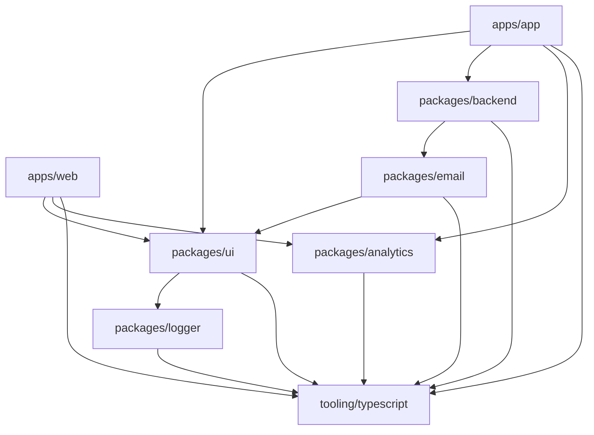

# Packages Documentation

This document covers all the shared packages in the DevResume.ai monorepo, their purposes, APIs, and implementation details.

## Table of Contents

- [Overview](#overview)
- [UI Package (@v1/ui)](#ui-package-v1ui)
- [Backend Package (@v1/backend)](#backend-package-v1backend)
- [Analytics Package (@v1/analytics)](#analytics-package-v1analytics)
- [Email Package (@v1/email)](#email-package-v1email)
- [Logger Package (@v1/logger)](#logger-package-v1logger)
- [TypeScript Tooling](#typescript-tooling)

## Overview

The monorepo uses shared packages to promote code reuse, maintain consistency, and provide clear separation of concerns. Each package serves a specific purpose and can be independently versioned and maintained.

### Package Dependencies



## UI Package (@v1/ui)

### Purpose
Provides a comprehensive UI component library built on top of Shadcn/ui, Radix UI, and Tailwind CSS. Ensures consistent design and behavior across all applications.

### Structure

```
packages/ui/src/
├── components/              # UI components
│   ├── avatar.tsx          # User avatars
│   ├── button.tsx          # Button variants
│   ├── dialog.tsx          # Modal dialogs
│   ├── dropdown-menu.tsx   # Dropdown menus
│   ├── icons.tsx           # Icon components
│   ├── input.tsx           # Form inputs
│   ├── logo.tsx            # Brand logo
│   ├── scroll-area.tsx     # Scrollable areas
│   ├── select.tsx          # Select dropdowns
│   ├── switch.tsx          # Toggle switches
│   ├── tooltip.tsx         # Tooltips
│   └── upload-input.tsx    # File upload
├── utils/                  # Utility functions
│   ├── index.ts           # Tailwind utilities
│   └── use-double-check.ts # Double-click hook
├── globals.css            # Global styles
└── tailwind.config.ts     # Tailwind configuration
```

### Key Components

#### Button Component
```typescript
interface ButtonProps
  extends React.ButtonHTMLAttributes<HTMLButtonElement>,
    VariantProps<typeof buttonVariants> {
  asChild?: boolean;
}

const buttonVariants = cva(
  "inline-flex items-center justify-center whitespace-nowrap rounded-md text-sm font-medium ring-offset-background transition-colors focus-visible:outline-none focus-visible:ring-2 focus-visible:ring-ring focus-visible:ring-offset-2 disabled:pointer-events-none disabled:opacity-50",
  {
    variants: {
      variant: {
        default: "bg-primary text-primary-foreground hover:bg-primary/90",
        destructive: "bg-destructive text-destructive-foreground hover:bg-destructive/90",
        outline: "border border-input bg-background hover:bg-accent hover:text-accent-foreground",
        secondary: "bg-secondary text-secondary-foreground hover:bg-secondary/80",
        ghost: "hover:bg-accent hover:text-accent-foreground",
        link: "text-primary underline-offset-4 hover:underline",
      },
      size: {
        default: "h-10 px-4 py-2",
        sm: "h-9 rounded-md px-3",
        lg: "h-11 rounded-md px-8",
        icon: "h-10 w-10",
      },
    },
    defaultVariants: {
      variant: "default",
      size: "default",
    },
  },
);
```

#### Usage Examples
```typescript
// Basic button
<Button>Click me</Button>

// Button variants
<Button variant="outline" size="sm">
  Small Outline
</Button>

// As child (polymorphic)
<Button asChild>
  <Link href="/dashboard">Dashboard</Link>
</Button>
```

### Styling System

#### Design Tokens
```css
:root {
  --background: 0 0% 100%;
  --foreground: 222.2 84% 4.9%;
  --primary: 222.2 47.4% 11.2%;
  --primary-foreground: 210 40% 98%;
  --secondary: 210 40% 96.1%;
  --secondary-foreground: 222.2 47.4% 11.2%;
  --muted: 210 40% 96.1%;
  --muted-foreground: 215.4 16.3% 46.9%;
  --accent: 210 40% 96.1%;
  --accent-foreground: 222.2 47.4% 11.2%;
  --destructive: 0 84.2% 60.2%;
  --destructive-foreground: 210 40% 98%;
  --border: 214.3 31.8% 91.4%;
  --input: 214.3 31.8% 91.4%;
  --ring: 222.2 84% 4.9%;
  --radius: 0.5rem;
}

.dark {
  --background: 0 0% 0%;
  --foreground: 0 0% 100%;
  --primary: 0 0% 100%;
  --primary-foreground: 0 0% 0%;
  /* ... dark theme tokens */
}
```

#### Utility Functions
```typescript
import { clsx, type ClassValue } from "clsx";
import { twMerge } from "tailwind-merge";

export function cn(...inputs: ClassValue[]) {
  return twMerge(clsx(inputs));
}
```

### Custom Hooks

#### useDoubleCheck
```typescript
export function useDoubleCheck() {
  const [doubleCheck, setDoubleCheck] = React.useState(false);

  function getButtonProps(props?: ButtonProps) {
    const onBlur: React.FocusEventHandler<HTMLButtonElement> = () =>
      setDoubleCheck(false);

    const onClick: React.MouseEventHandler<HTMLButtonElement> = doubleCheck
      ? undefined
      : (e) => {
          e.preventDefault();
          setDoubleCheck(true);
        };

    const onKeyUp: React.KeyboardEventHandler<HTMLButtonElement> = (e) => {
      if (e.key === "Escape") {
        setDoubleCheck(false);
      }
    };

    return {
      ...props,
      onBlur: callAll(onBlur, props?.onBlur),
      onClick: callAll(onClick, props?.onClick),
      onKeyUp: callAll(onKeyUp, props?.onKeyUp),
    };
  }

  return { doubleCheck, getButtonProps };
}
```

## Backend Package (@v1/backend)

### Purpose
Contains all Convex backend code including database schema, functions, authentication, and external service integrations.

### Key Features
- Convex database and functions
- Authentication with Convex Auth
- Polar billing integration
- File storage management
- Email system integration
- Webhook handling

*Detailed backend documentation is available in [backend.md](./backend.md)*

## Analytics Package (@v1/analytics)

### Purpose
Provides analytics tracking functionality using OpenPanel, with privacy-focused analytics and event tracking capabilities.

### Structure

```
packages/analytics/src/
├── client.tsx              # Client-side analytics
└── server.ts               # Server-side analytics
```

### Implementation

#### Client-side Analytics
```typescript
import {
  OpenPanelComponent,
  type PostEventPayload,
  useOpenPanel,
} from "@openpanel/nextjs";
import { logger } from "@v1/logger";

const isProd = process.env.NODE_ENV === "production";

// Analytics provider component
const Provider = () => (
  <OpenPanelComponent
    clientId={process.env.NEXT_PUBLIC_OPENPANEL_CLIENT_ID!}
    trackAttributes={true}
    trackScreenViews={isProd}
    trackOutgoingLinks={isProd}
  />
);

// Event tracking function
const track = (options: { event: string } & PostEventPayload["properties"]) => {
  const { track: openTrack } = useOpenPanel();

  if (!isProd) {
    logger.info("Track", options);
    return;
  }

  const { event, ...rest } = options;
  openTrack(event, rest);
};

export { Provider, track };
```

### Usage Examples

```typescript
// Add provider to app
import { Provider as AnalyticsProvider } from "@v1/analytics/client";

export default function RootLayout({ children }) {
  return (
    <html>
      <body>
        {children}
        <AnalyticsProvider />
      </body>
    </html>
  );
}

// Track events
import { track } from "@v1/analytics/client";

// User signup
track({
  event: "user_signup",
  method: "google",
  timestamp: Date.now(),
});

// Page view
track({
  event: "page_view",
  page: "/dashboard",
  referrer: document.referrer,
});

// Custom events
track({
  event: "feature_used",
  feature: "export_resume",
  user_id: user.id,
});
```

## Email Package (@v1/email)

### Purpose
Provides email template system using React Email with Tailwind CSS styling for consistent, responsive email designs.

### Structure

```
packages/email/
├── components/             # Reusable email components
│   └── logo.tsx           # Brand logo component
├── emails/                # Email templates
│   └── welcome.tsx        # Welcome email template
├── package.json
└── tsconfig.json
```

### Email Templates

#### Welcome Email
```typescript
import {
  Body,
  Button,
  Container,
  Heading,
  Hr,
  Html,
  Img,
  Link,
  Preview,
  Section,
  Tailwind,
} from "@react-email/components";

const baseUrl = process.env.VERCEL_URL
  ? `https://${process.env.VERCEL_URL}`
  : "http://localhost:3001";

export default function WelcomeEmail() {
  return (
    <Html>
      <Preview>Welcome to DevResume.ai</Preview>
      <Tailwind>
        <Body className="my-auto mx-auto font-sans">
          <Container className="border-transparent my-[40px] mx-auto max-w-[600px]">
            
            <Heading className="font-normal text-center p-0 my-[30px] mx-0">
              Welcome to DevResume.ai
            </Heading>
            <Section className="mb-4">
              Hi, welcome to our platform!
            </Section>
            <Section className="mb-4">
              Get started by exploring your dashboard and creating your first resume.
            </Section>
            <Section className="mb-6">
              <Link href={baseUrl}>
                <Button className="bg-black text-white p-4 text-center">
                  Get started
                </Button>
              </Link>
            </Section>
            <Hr />
          </Container>
        </Body>
      </Tailwind>
    </Html>
  );
}
```

### Logo Component
```typescript
export function Logo() {
  return (
    
  );
}
```

### Usage in Backend

```typescript
// In Convex functions
import { Resend } from "resend";
import WelcomeEmail from "@v1/email/emails/welcome";

const resend = new Resend(process.env.RESEND_API_KEY);

export const sendWelcomeEmail = action({
  args: { email: v.string(), name: v.string() },
  handler: async (ctx, { email, name }) => {
    await resend.emails.send({
      from: "DevResume.ai <noreply@devresume.ai>",
      to: [email],
      subject: "Welcome to DevResume.ai!",
      react: WelcomeEmail({ name }),
    });
  },
});
```

## Logger Package (@v1/logger)

### Purpose
Provides centralized logging functionality with consistent formatting and different log levels for development and production environments.

### Structure

```
packages/logger/src/
└── index.ts               # Logger implementation
```

### Implementation

```typescript
interface Logger {
  info: (message: string, ...args: any[]) => void;
  error: (message: string, ...args: any[]) => void;
  warn: (message: string, ...args: any[]) => void;
  debug: (message: string, ...args: any[]) => void;
}

const createLogger = (): Logger => {
  const isDevelopment = process.env.NODE_ENV === "development";
  
  return {
    info: (message: string, ...args: any[]) => {
      if (isDevelopment) {
        console.log(`[INFO] ${message}`, ...args);
      }
    },
    
    error: (message: string, ...args: any[]) => {
      console.error(`[ERROR] ${message}`, ...args);
    },
    
    warn: (message: string, ...args: any[]) => {
      console.warn(`[WARN] ${message}`, ...args);
    },
    
    debug: (message: string, ...args: any[]) => {
      if (isDevelopment) {
        console.debug(`[DEBUG] ${message}`, ...args);
      }
    },
  };
};

export const logger = createLogger();
```

### Usage Examples

```typescript
import { logger } from "@v1/logger";

// Information logging
logger.info("User logged in", { userId: "123", timestamp: Date.now() });

// Error logging
logger.error("Database connection failed", error);

// Warning logging
logger.warn("Rate limit approaching", { requests: 95, limit: 100 });

// Debug logging (development only)
logger.debug("Function called with args", args);

// In analytics package
const track = (options) => {
  if (!isProd) {
    logger.info("Track", options);
    return;
  }
  // ... actual tracking
};
```

## TypeScript Tooling

### Purpose
Provides shared TypeScript configurations to ensure consistent type checking, compilation settings, and code quality across all packages and applications.

### Structure

```
tooling/typescript/
├── base.json              # Base TypeScript config
├── nextjs.json           # Next.js specific config
├── react-library.json    # React library config
└── package.json
```

### Base Configuration
```json
{
  "compilerOptions": {
    "target": "ES2022",
    "lib": ["dom", "dom.iterable", "ES6"],
    "allowJs": true,
    "skipLibCheck": true,
    "strict": true,
    "forceConsistentCasingInFileNames": true,
    "noEmit": true,
    "esModuleInterop": true,
    "module": "esnext",
    "moduleResolution": "node",
    "resolveJsonModule": true,
    "isolatedModules": true,
    "jsx": "preserve",
    "incremental": true,
    "plugins": [
      {
        "name": "next"
      }
    ],
    "baseUrl": ".",
    "paths": {
      "@/*": ["./src/*"]
    }
  },
  "include": [
    "next-env.d.ts",
    "**/*.ts",
    "**/*.tsx",
    ".next/types/**/*.ts"
  ],
  "exclude": [
    "node_modules"
  ]
}
```

### Next.js Configuration
```json
{
  "extends": "./base.json",
  "compilerOptions": {
    "plugins": [{ "name": "next" }]
  },
  "include": [
    "next-env.d.ts",
    "**/*.ts",
    "**/*.tsx",
    ".next/types/**/*.ts"
  ]
}
```

### Usage in Applications

```json
// apps/app/tsconfig.json
{
  "extends": "@v1/typescript-config/nextjs.json",
  "compilerOptions": {
    "baseUrl": ".",
    "paths": {
      "@/*": ["./src/*"]
    }
  },
  "include": ["next-env.d.ts", "**/*.ts", "**/*.tsx"],
  "exclude": ["node_modules"]
}

// packages/ui/tsconfig.json
{
  "extends": "@v1/typescript-config/react-library.json",
  "compilerOptions": {
    "baseUrl": ".",
    "paths": {
      "@/*": ["./src/*"]
    }
  }
}
```

---

These shared packages provide the foundation for consistent, maintainable, and scalable development across the entire DevResume.ai platform. Each package is designed to be independently maintainable while contributing to the overall system architecture. 