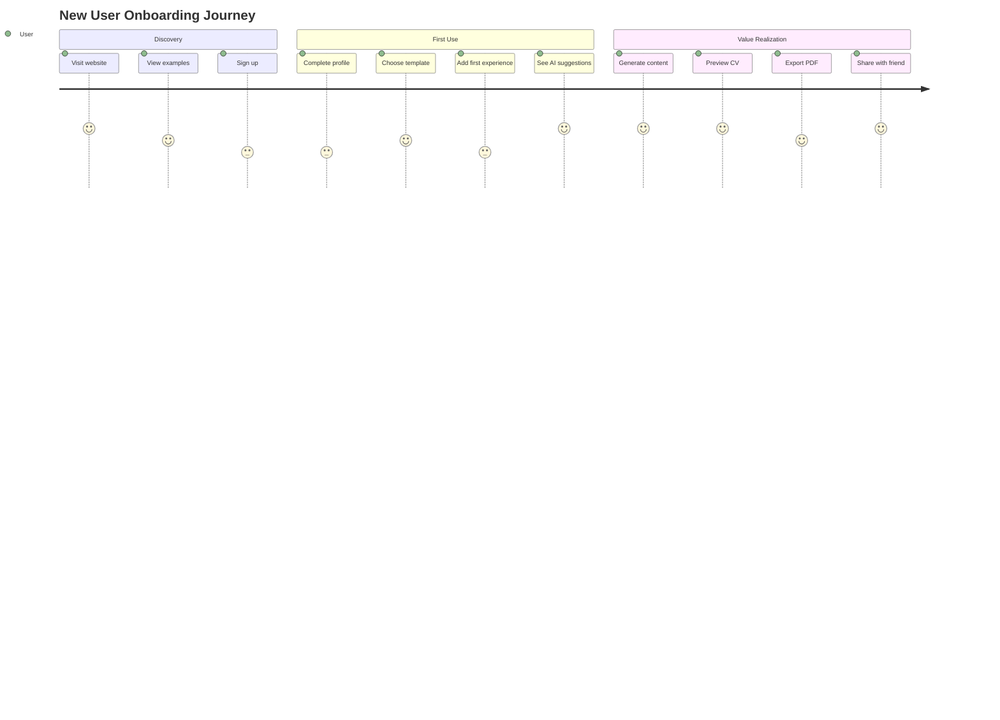
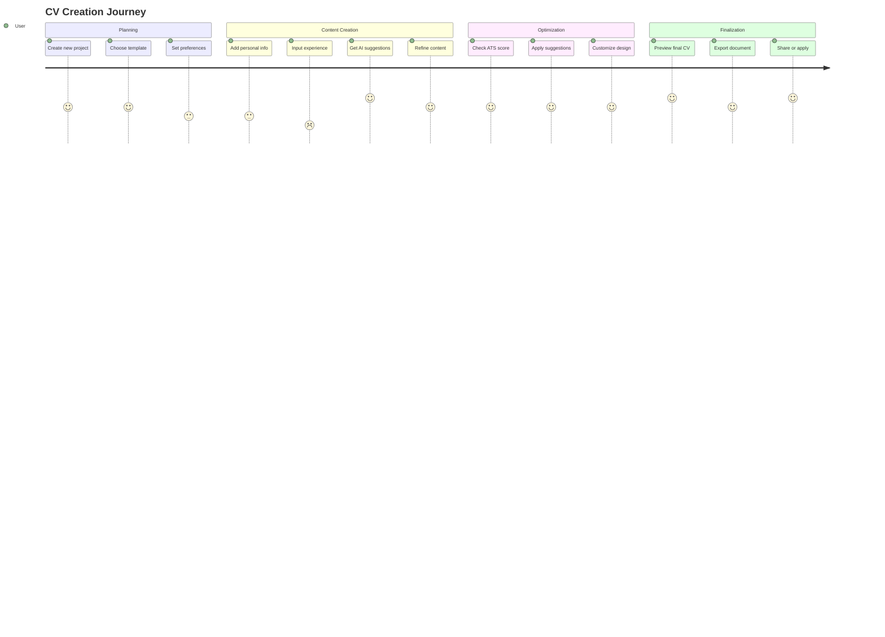

# UI/UX Specifications - AI CV & Cover Letter Maker

This document outlines the complete UI/UX specifications for the DevResume.ai platform, including user flows, wireframes, design system, and interaction patterns.

## Table of Contents

- [Design Philosophy](#design-philosophy)
- [User Personas](#user-personas)
- [User Journey Maps](#user-journey-maps)
- [Information Architecture](#information-architecture)
- [Design System](#design-system)
- [Page Specifications](#page-specifications)
- [Component Library](#component-library)
- [Responsive Design](#responsive-design)
- [Accessibility](#accessibility)

## Design Philosophy

### Core Principles

1. **Simplicity First**: Clean, uncluttered interface that doesn't overwhelm users
2. **AI-Powered Assistance**: Seamlessly integrated AI that feels helpful, not intrusive
3. **Professional Focus**: Design that inspires confidence in professional outcomes
4. **Instant Feedback**: Real-time previews and immediate visual confirmation
5. **Progressive Disclosure**: Show complexity only when needed

### Visual Identity

- **Modern Minimalism**: Clean lines, ample whitespace, purposeful design
- **Professional Palette**: Sophisticated colors that convey trust and competence
- **Typography**: Clear, readable fonts that work in both digital and print contexts
- **Iconography**: Consistent, intuitive icons that enhance usability

## User Personas

### Primary Persona: Sarah - Recent Graduate
- **Age**: 22-25
- **Background**: Computer Science graduate, first job search
- **Goals**: Create professional CV, stand out from competition
- **Pain Points**: No professional experience, unsure of formatting
- **Tech Savvy**: High
- **Preferred Features**: AI suggestions, modern templates, ATS optimization

### Secondary Persona: Michael - Career Changer
- **Age**: 30-40
- **Background**: Marketing professional transitioning to tech
- **Goals**: Highlight transferable skills, create compelling narrative
- **Pain Points**: Explaining career transition, tailoring for different roles
- **Tech Savvy**: Medium
- **Preferred Features**: Cover letter generator, industry-specific templates

### Tertiary Persona: Lisa - Hiring Manager
- **Age**: 35-45
- **Background**: HR professional, reviews 100+ CVs weekly
- **Goals**: Quickly identify qualified candidates
- **Pain Points**: Poorly formatted CVs, irrelevant information
- **Tech Savvy**: Medium
- **Insights**: Influences ATS-friendly design requirements

## User Journey Maps

### New User Onboarding Journey



### CV Creation Journey



## Information Architecture

### Site Map

```
DevResume.ai
├── Marketing Site (/)
│   ├── Homepage
│   ├── Features
│   ├── Templates
│   ├── Pricing
│   ├── Blog
│   └── Contact
├── Dashboard (/dashboard)
│   ├── Projects Overview
│   ├── Recent Activity
│   └── Quick Actions
├── CV Builder (/cv-builder)
│   ├── Template Selection
│   ├── Content Editor
│   ├── Preview Panel
│   └── Export Options
├── Cover Letter (/cover-letter)
│   ├── Job Details Input
│   ├── AI Generation
│   ├── Customization
│   └── Preview & Export
├── Templates (/templates)
│   ├── Browse Gallery
│   ├── Category Filters
│   ├── Preview Modal
│   └── Apply Template
├── Settings (/settings)
│   ├── Profile
│   ├── Preferences
│   ├── Billing
│   └── Account
└── Help (/help)
    ├── Getting Started
    ├── Tutorials
    ├── FAQ
    └── Contact Support
```

## Design System

### Color Palette

```css
/* Primary Colors */
--primary-50: #f0f9ff;
--primary-100: #e0f2fe;
--primary-500: #0ea5e9;
--primary-600: #0284c7;
--primary-900: #0c4a6e;

/* Neutral Colors */
--neutral-50: #fafafa;
--neutral-100: #f5f5f5;
--neutral-200: #e5e5e5;
--neutral-500: #737373;
--neutral-700: #404040;
--neutral-900: #171717;

/* Semantic Colors */
--success: #10b981;
--warning: #f59e0b;
--error: #ef4444;
--info: #3b82f6;
```

### Typography Scale

```css
/* Font Families */
--font-sans: 'Inter', system-ui, sans-serif;
--font-mono: 'JetBrains Mono', monospace;

/* Font Sizes */
--text-xs: 0.75rem;    /* 12px */
--text-sm: 0.875rem;   /* 14px */
--text-base: 1rem;     /* 16px */
--text-lg: 1.125rem;   /* 18px */
--text-xl: 1.25rem;    /* 20px */
--text-2xl: 1.5rem;    /* 24px */
--text-3xl: 1.875rem;  /* 30px */
--text-4xl: 2.25rem;   /* 36px */

/* Font Weights */
--font-normal: 400;
--font-medium: 500;
--font-semibold: 600;
--font-bold: 700;
```

### Spacing System

```css
/* Spacing Scale */
--space-1: 0.25rem;   /* 4px */
--space-2: 0.5rem;    /* 8px */
--space-3: 0.75rem;   /* 12px */
--space-4: 1rem;      /* 16px */
--space-6: 1.5rem;    /* 24px */
--space-8: 2rem;      /* 32px */
--space-12: 3rem;     /* 48px */
--space-16: 4rem;     /* 64px */
--space-24: 6rem;     /* 96px */
```

### Border Radius

```css
--radius-sm: 0.25rem;   /* 4px */
--radius-md: 0.375rem;  /* 6px */
--radius-lg: 0.5rem;    /* 8px */
--radius-xl: 0.75rem;   /* 12px */
--radius-full: 9999px;
```

## Page Specifications

### 1. Dashboard Page

#### Layout Structure
```
┌─────────────────────────────────────────────────┐
│ Header (Navigation + User Menu)                │
├─────────────────────────────────────────────────┤
│ Welcome Section                                 │
│ ├─ Greeting + Quick Stats                      │
│ └─ Quick Actions (New CV, New Cover Letter)    │
├─────────────────────────────────────────────────┤
│ Projects Section                                │
│ ├─ Filter/Search Bar                           │
│ ├─ View Toggle (Grid/List)                     │
│ └─ Project Cards Grid                          │
├─────────────────────────────────────────────────┤
│ Recent Activity Sidebar                         │
│ ├─ Recent Exports                              │
│ ├─ AI Usage Stats                              │
│ └─ Tips & Tutorials                            │
└─────────────────────────────────────────────────┘
```

#### Key Components
- **Project Card**: Thumbnail preview, project name, status, last modified
- **Quick Actions**: Large, prominent buttons for creating new projects
- **Activity Feed**: Timeline of recent actions and achievements
- **Stats Dashboard**: Usage metrics and success indicators

### 2. CV Builder Interface

#### Split-Panel Layout
```
┌─────────────────────────────────────────────────┐
│ Header (Save, Export, Share buttons)           │
├─────────────────┬───────────────────────────────┤
│ Content Editor  │ Live Preview Panel            │
│                 │                               │
│ ├─ Sections     │ ├─ CV Preview                │
│ │  ├─ Personal  │ │  (Real-time updates)       │
│ │  ├─ Summary   │ │                            │
│ │  ├─ Experience│ │                            │
│ │  ├─ Education │ │                            │
│ │  ├─ Skills    │ │                            │
│ │  └─ Custom    │ │                            │
│ │               │ │                            │
│ ├─ AI Assistant │ ├─ Template Switcher         │
│ │  ├─ Suggestions│ ├─ Customization Panel      │
│ │  ├─ ATS Score │ │  ├─ Colors                │
│ │  └─ Tips      │ │  ├─ Fonts                 │
│ │               │ │  └─ Layout                │
│ └─ Progress     │ └─ Export Options            │
└─────────────────┴───────────────────────────────┘
```

#### Content Editor Sections

**Personal Information**
```
┌─────────────────────────────────────────────────┐
│ Personal Information                            │
│ ┌─────────────┐ ┌─────────────────────────────┐ │
│ │ Photo       │ │ Full Name        [_______] │ │
│ │ Upload      │ │ Email           [_______] │ │
│ │ [+]         │ │ Phone           [_______] │ │
│ │             │ │ Location        [_______] │ │
│ └─────────────┘ │ LinkedIn        [_______] │ │
│                 │ Website         [_______] │ │
│                 └─────────────────────────────┘ │
│ Professional Summary                            │
│ ┌─────────────────────────────────────────────┐ │
│ │ [Text area with AI suggestions]             │ │
│ │ ✨ AI Suggest  📝 Improve  📊 ATS Check   │ │
│ └─────────────────────────────────────────────┘ │
└─────────────────────────────────────────────────┘
```

**Experience Section**
```
┌─────────────────────────────────────────────────┐
│ Work Experience                    [+ Add New]  │
│ ┌─────────────────────────────────────────────┐ │
│ │ Job Title           [_________________]     │ │
│ │ Company             [_________________]     │ │
│ │ Location            [_________________]     │ │
│ │ Start Date [MM/YYYY] End Date [MM/YYYY]    │ │
│ │ ☐ Currently working here                   │ │
│ │                                            │ │
│ │ Description & Achievements                 │ │
│ │ ┌─────────────────────────────────────────┐ │ │
│ │ │ • [Bullet point 1]                     │ │ │
│ │ │ • [Bullet point 2]                     │ │ │
│ │ │ • [Bullet point 3]                     │ │ │
│ │ └─────────────────────────────────────────┘ │ │
│ │ ✨ Generate with AI  📈 Add metrics       │ │
│ │ 🎯 Optimize for ATS  🏷️ Add skills        │ │
│ └─────────────────────────────────────────────┘ │
└─────────────────────────────────────────────────┘
```

#### AI Assistant Panel
```
┌─────────────────────────────────────────────────┐
│ AI Assistant                              [🤖] │
│ ┌─────────────────────────────────────────────┐ │
│ │ ATS Optimization Score                      │ │
│ │ ████████░░ 82/100                          │ │
│ │                                            │ │
│ │ Suggestions:                               │ │
│ │ • Add more industry keywords               │ │
│ │ • Quantify achievements with numbers       │ │
│ │ • Improve skills section formatting       │ │
│ └─────────────────────────────────────────────┘ │
│                                                 │
│ ┌─────────────────────────────────────────────┐ │
│ │ Content Suggestions                         │ │
│ │ Based on "Software Engineer" role:          │ │
│ │                                            │ │
│ │ "Developed scalable web applications..."    │ │
│ │ [Use This] [Modify] [Dismiss]              │ │
│ │                                            │ │
│ │ "Led cross-functional team of 5..."        │ │
│ │ [Use This] [Modify] [Dismiss]              │ │
│ └─────────────────────────────────────────────┘ │
└─────────────────────────────────────────────────┘
```

### 3. Template Gallery

#### Grid Layout
```
┌─────────────────────────────────────────────────┐
│ Template Gallery                                │
│ ┌─────────────────────────────────────────────┐ │
│ │ Filters: [All] [Professional] [Creative]   │ │
│ │          [Technical] [Academic] [Modern]    │ │
│ │ Search: [_________________] 🔍             │ │
│ └─────────────────────────────────────────────┘ │
│                                                 │
│ ┌─────┐ ┌─────┐ ┌─────┐ ┌─────┐                │
│ │ T1  │ │ T2  │ │ T3  │ │ T4  │                │
│ │ PRO │ │ FREE│ │ PRO │ │ FREE│                │
│ │ ⭐  │ │     │ │ ⭐  │ │     │                │
│ └─────┘ └─────┘ └─────┘ └─────┘                │
│                                                 │
│ ┌─────┐ ┌─────┐ ┌─────┐ ┌─────┐                │
│ │ T5  │ │ T6  │ │ T7  │ │ T8  │                │
│ │ FREE│ │ PRO │ │ PRO │ │ FREE│                │
│ │     │ │ ⭐  │ │ ⭐  │ │     │                │
│ └─────┘ └─────┘ └─────┘ └─────┘                │
└─────────────────────────────────────────────────┘
```

#### Template Card
```
┌─────────────────────────────────────┐
│ ┌─────────────────────────────────┐ │
│ │                                 │ │
│ │        Template Preview         │ │
│ │                                 │ │
│ │                                 │ │
│ └─────────────────────────────────┘ │
│ Modern Professional            ⭐PRO │
│ Perfect for tech roles              │
│ Used by 1,234 people               │
│                                     │
│ [Preview] [Use Template]            │
└─────────────────────────────────────┘
```

### 4. Cover Letter Generator

#### Step-by-Step Interface
```
┌─────────────────────────────────────────────────┐
│ Cover Letter Generator                          │
│ Step 1 of 3: Job Details                       │
│ ●●●○○○○○○○ 30% Complete                        │
│                                                 │
│ ┌─────────────────────────────────────────────┐ │
│ │ Job Title          [_________________]     │ │
│ │ Company Name       [_________________]     │ │
│ │ Job Description                            │ │
│ │ ┌─────────────────────────────────────────┐ │ │
│ │ │ [Paste job description here...]        │ │ │
│ │ │                                        │ │ │
│ │ │                                        │ │ │
│ │ └─────────────────────────────────────────┘ │ │
│ │                                            │ │
│ │ Hiring Manager     [_________________]     │ │
│ │ (Optional)                                 │ │
│ └─────────────────────────────────────────────┘ │
│                                                 │
│ [← Back]                    [Continue →]       │
└─────────────────────────────────────────────────┘
```

#### AI Generation Results
```
┌─────────────────────────────────────────────────┐
│ Generated Cover Letter                          │
│ ┌─────────────────────────────────────────────┐ │
│ │ Match Score: 89% 📊                        │ │
│ │ Tone: Professional 🎯                      │ │
│ │ Length: 312 words 📝                       │ │
│ └─────────────────────────────────────────────┘ │
│                                                 │
│ ┌─────────────────────────────────────────────┐ │
│ │ Dear Hiring Manager,                        │ │
│ │                                            │ │
│ │ I am writing to express my strong interest │ │
│ │ in the Software Engineer position at...    │ │
│ │                                            │ │
│ │ [Generated content continues...]           │ │
│ └─────────────────────────────────────────────┘ │
│                                                 │
│ Customization Options:                          │
│ Tone: [Professional] [Enthusiastic] [Creative] │
│ Length: [Short] [Medium] [Long]                 │
│                                                 │
│ [🔄 Regenerate] [✏️ Edit] [💾 Save] [📤 Export] │
└─────────────────────────────────────────────────┘
```

## Component Library

### Form Components

#### Input Field
```typescript
interface InputProps {
  label: string;
  placeholder?: string;
  type?: 'text' | 'email' | 'tel' | 'url';
  required?: boolean;
  error?: string;
  helpText?: string;
  icon?: ReactNode;
  aiSuggestions?: boolean;
}
```

#### AI Text Area
```typescript
interface AITextAreaProps {
  label: string;
  placeholder?: string;
  rows?: number;
  maxLength?: number;
  aiEnabled?: boolean;
  context?: string;
  onAISuggestion?: (suggestion: string) => void;
}
```

#### Template Selector
```typescript
interface TemplateSelectorProps {
  templates: Template[];
  selectedId?: string;
  onSelect: (templateId: string) => void;
  showPremiumBadge?: boolean;
  filterBy?: string[];
}
```

### AI Components

#### AI Suggestion Card
```typescript
interface AISuggestionProps {
  content: string;
  confidence: number;
  type: 'content' | 'improvement' | 'optimization';
  onAccept: () => void;
  onReject: () => void;
  onModify: () => void;
}
```

#### ATS Score Display
```typescript
interface ATSScoreProps {
  score: number;
  recommendations: Recommendation[];
  onOptimize: () => void;
  isLoading?: boolean;
}
```

### Navigation Components

#### Progress Indicator
```typescript
interface ProgressProps {
  steps: string[];
  currentStep: number;
  completedSteps: number[];
  onStepClick?: (step: number) => void;
}
```

#### Section Navigator
```typescript
interface SectionNavProps {
  sections: Section[];
  activeSection: string;
  onSectionChange: (sectionId: string) => void;
  completionStatus: Record<string, boolean>;
}
```

## Responsive Design

### Breakpoints
```css
/* Mobile First Approach */
--breakpoint-sm: 640px;   /* Small devices */
--breakpoint-md: 768px;   /* Medium devices */
--breakpoint-lg: 1024px;  /* Large devices */
--breakpoint-xl: 1280px;  /* Extra large devices */
--breakpoint-2xl: 1536px; /* 2X large devices */
```

### Mobile Layout Adaptations

#### Dashboard (Mobile)
```
┌─────────────────────┐
│ Header              │
├─────────────────────┤
│ Quick Actions       │
│ [New CV] [New CL]   │
├─────────────────────┤
│ Search & Filter     │
├─────────────────────┤
│ Project List        │
│ ┌─────────────────┐ │
│ │ Project 1       │ │
│ │ Last: 2 days    │ │
│ └─────────────────┘ │
│ ┌─────────────────┐ │
│ │ Project 2       │ │
│ │ Last: 1 week    │ │
│ └─────────────────┘ │
├─────────────────────┤
│ Bottom Navigation   │
│ [Home][Create][Me]  │
└─────────────────────┘
```

#### CV Builder (Mobile)
```
┌─────────────────────┐
│ Header + Save       │
├─────────────────────┤
│ Section Tabs        │
│ [Info][Exp][Edu]    │
├─────────────────────┤
│ Content Editor      │
│ (Full width)        │
│                     │
│                     │
│                     │
├─────────────────────┤
│ [Preview] [AI Help] │
├─────────────────────┤
│ Action Buttons      │
│ [Save] [Export]     │
└─────────────────────┘
```

### Tablet Layout
- Side-by-side panels become stacked
- Navigation becomes collapsible
- Touch-friendly button sizing (44px minimum)
- Optimized for both portrait and landscape

## Accessibility

### WCAG 2.1 AA Compliance

#### Color & Contrast
- Minimum contrast ratio of 4.5:1 for normal text
- Minimum contrast ratio of 3:1 for large text
- Color is not the only means of conveying information

#### Keyboard Navigation
- All interactive elements are keyboard accessible
- Logical tab order throughout the interface
- Visible focus indicators
- Skip links for main content areas

#### Screen Reader Support
- Semantic HTML structure
- ARIA labels and descriptions
- Alt text for all images
- Form labels properly associated

#### Responsive & Zoom
- Content reflows at 400% zoom
- No horizontal scrolling at standard zoom levels
- Touch targets minimum 44x44px

### Implementation Examples

#### Accessible Form Field
```typescript
<div className="form-field">
  <label htmlFor="job-title" className="sr-only">
    Job Title
  </label>
  <input
    id="job-title"
    type="text"
    placeholder="Job Title"
    aria-describedby="job-title-help"
    aria-required="true"
    className="input-field"
  />
  <div id="job-title-help" className="help-text">
    Enter the exact job title from the posting
  </div>
</div>
```

#### Accessible AI Suggestion
```typescript
<div 
  role="region" 
  aria-labelledby="ai-suggestions-title"
  className="ai-suggestions"
>
  <h3 id="ai-suggestions-title">AI Content Suggestions</h3>
  <ul role="list">
    {suggestions.map((suggestion, index) => (
      <li key={index} role="listitem">
        <div className="suggestion-content">
          {suggestion.text}
        </div>
        <div className="suggestion-actions">
          <button
            onClick={() => acceptSuggestion(suggestion)}
            aria-label={`Accept suggestion: ${suggestion.text}`}
          >
            Accept
          </button>
          <button
            onClick={() => rejectSuggestion(suggestion)}
            aria-label={`Reject suggestion: ${suggestion.text}`}
          >
            Reject
          </button>
        </div>
      </li>
    ))}
  </ul>
</div>
```

This comprehensive UI/UX specification provides the foundation for building a user-friendly, accessible, and professional AI-powered CV and Cover Letter Maker that will delight users and drive business success. 